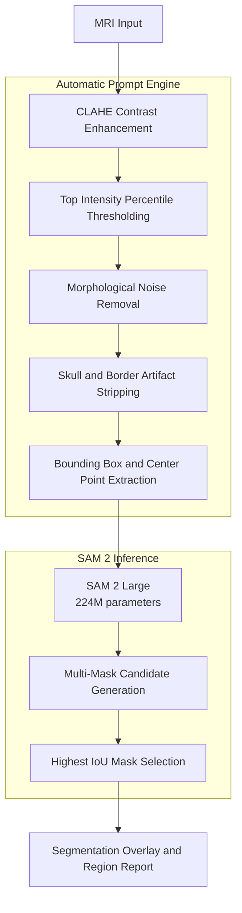

# SAM2-Zero-Shot-Tumor-Segmentation

Zero-shot brain and breast tumor segmentation in MRI scans using Meta's SAM 2, driven by an automatic prompt generation engine — no fine-tuning, no labeled data, no manual clicks.

## Overview

This project applies Meta's Segment Anything Model 2 to medical imaging without any fine-tuning, labeled data, or manual annotation. An automatic prompt generation engine derives bounding boxes and point prompts directly from MRI signal characteristics, enabling SAM 2 to segment tumor regions across brain and breast MRI scans out of the box.

The system was tested on brain MRI and breast imaging and handles multiple tumor regions per scan simultaneously, working across different tumor types and anatomical locations without modification.

This is a research and educational project. All outputs require radiologist review before any clinical use.

## Demo

### Brain tumor segmentation

<table>
<tr>
<td align="center"><b>Input MRI</b></td>
<td align="center"><b>Segmentation Overlay</b></td>
</tr>
<tr>
<td></td>
<td></td>
</tr>
</table>

### Breast tumor segmentation

<table>
<tr>
<td align="center"><b>Input MRI</b></td>
<td align="center"><b>Segmentation Overlay</b></td>
</tr>
<tr>
<td></td>
<td></td>
</tr>
</table>

Both examples show the same pipeline running unmodified — no per-scan tuning, no manual prompts, no anatomy-specific configuration.

## How It Works

Standard SAM 2 deployments require a human to click on the object of interest to generate prompts. This system replaces that manual step with an automated pipeline built around MRI signal physics.

Tumors appear hyper-intense on T1-contrast and FLAIR sequences. The prompt engine exploits this property, processing the raw image through a series of steps to identify and localize those regions automatically, then feeding the resulting coordinates to SAM 2 as native bounding box and point prompts.

## Architecture



The prompt engine (left of the pipeline) is the only custom component — it exists purely to replace the manual click a standard SAM 2 workflow would require. Everything downstream of the bounding box and point extraction step is stock SAM 2 Large, unmodified and unfine-tuned.

## Model

| Property | Detail |
|----------|--------|
| Model | SAM 2 Large |
| Source | facebook/sam2-hiera-large |
| Parameters | 224M |
| Encoder | Hiera Hierarchical Vision Transformer |
| Decoder | Streaming Memory Attention + Mask Decoder |
| Fine-tuning | None |
| Labeled data used | None |

## Key Features

- Fully automatic, no manual clicks or annotation required
- Handles multiple tumor regions per scan in a single pass
- Works across brain and breast MRI without modification
- Runs on Kaggle free-tier GPU (T4 16GB, well within VRAM limits)
- Clean clinical dashboard UI built with Gradio
- Region-level report with pixel area and percentage coverage per detected region

## Installation

```bash
pip install git+https://github.com/facebookresearch/sam2.git transformers gradio torch torchvision pillow numpy opencv-python matplotlib
```

## Usage

```bash
python brain_tumor_sam2.py
```

The Gradio interface will launch and generate a public shareable link via `share=True`. Upload any brain or breast MRI scan in JPG, PNG, or TIFF format and click Run Segmentation.

## Supported Inputs

- T1-contrast enhanced MRI (recommended)
- T2-weighted MRI
- FLAIR sequences
- Axial slice screenshots from DICOM viewers
- JPG, PNG, TIFF formats

## Hardware Requirements

| Resource | Minimum | Recommended |
|----------|---------|-------------|
| GPU VRAM | 4 GB | 8 GB+ |
| RAM | 8 GB | 16 GB |
| Tested on | Kaggle T4 16GB | Kaggle 2x T4 |

## Limitations

- Performance depends on tumor contrast relative to surrounding tissue. Low-contrast lesions on non-enhanced sequences may not segment reliably.
- The intensity thresholding logic assumes tumor regions are among the brightest structures in the image. This assumption holds well for T1-contrast and FLAIR but may vary on other sequences.
- This is not a validated medical device and has not been evaluated on a clinical benchmark dataset.

## Clinical Disclaimer

This tool is intended for research and educational purposes only. It is not a certified medical device. All segmentation outputs must be reviewed and verified by a qualified radiologist before informing any clinical decision.

## Citation

If you use this project in your work, please cite the original SAM 2 paper:

```bibtex
@article{ravi2024sam2,
  title={SAM 2: Segment Anything in Images and Videos},
  author={Ravi, Nikhila and Gabeur, Valentin and Hu, Yuan-Ting and others},
  journal={arXiv preprint arXiv:2408.00714},
  year={2024}
}
```

## Author

Rumi Iqbal Sufi
AI Engineer, Healthcare
GitHub: https://github.com/sufirumii
LinkedIn: https://www.linkedin.com/in/rumi-sufi-6323a5265/

## License

Apache License 2.0
